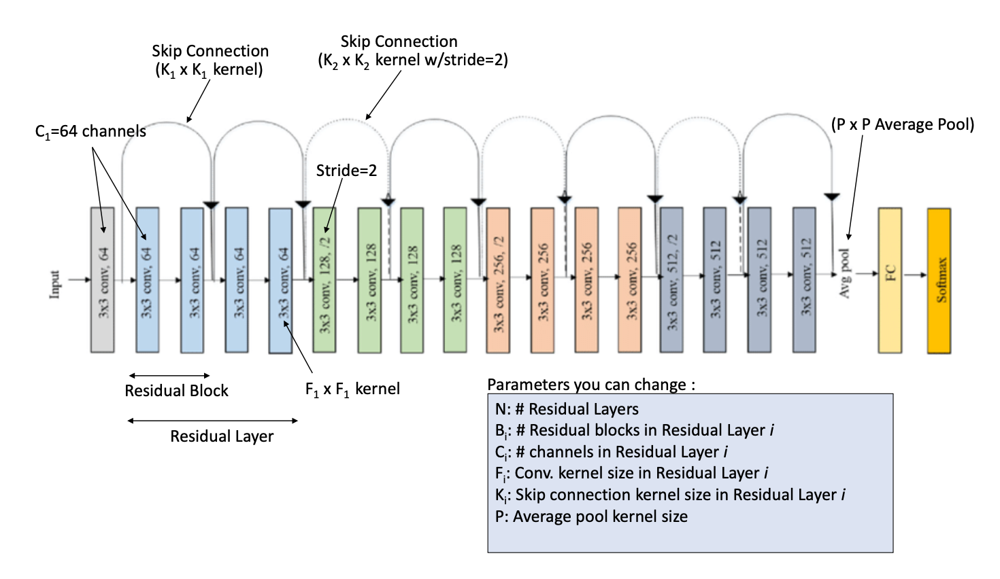
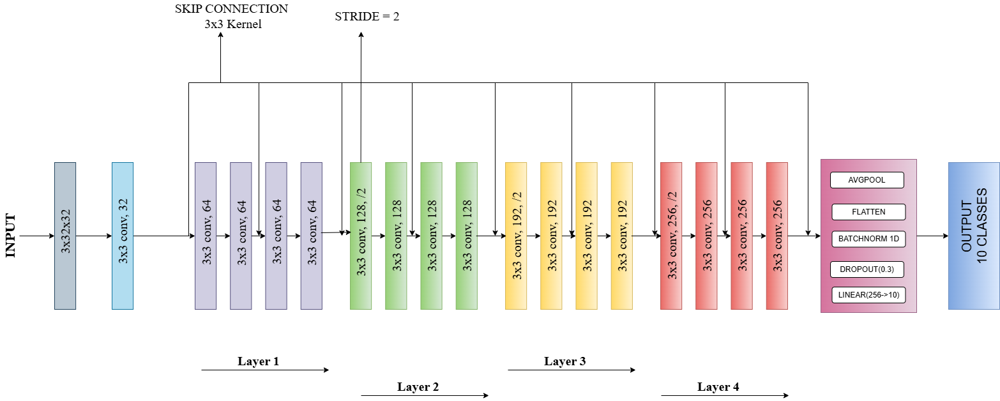

# ResNet-CIFAR-10

## Overview
This repository contains the implementation of an improved ResNet model for image classification on the CIFAR-10 dataset. The model balances accuracy and efficiency by utilizing a custom ResNet architecture with optimized training strategies.

## Final Model
The final trained model can be found in the Jupyter Notebook: **DL_Project_1_main.ipynb**. This notebook includes the complete training pipeline, evaluation metrics, and model architecture.

### Trained Model Link
You can access the trained model here: [Trained Model on Google Drive](https://drive.google.com/drive/folders/1gmAXhLqKZ-XWYBMUrk87qFb7YoZvKHaX?usp=sharing).

## Methodology
### Model Architecture
- Custom ResNet with a progressive filter strategy: (32 → 64 → 128 → 192 → 256).
- Two residual blocks per layer.
- Strategic dropout (0.2 - 0.3) to prevent overfitting.

### Training Optimization
- Optimizer: Stochastic Gradient Descent (SGD) with Nesterov momentum (0.9).
- Weight decay: 0.0005.
- Learning rate scheduler: OneCycleLR.
- Label smoothing quotient: 0.1.
- Gradient clipping to stabilize training.

## Results
- **Training Accuracy:** 98.71%
- **Validation Accuracy:** 94.31%
- **Model Parameters:** 4.17 million

## Model Architecture
### Initial Model


### Improved Model


## Usage
To use this model:
1. Clone the repository:
   ```bash
   git clone https://github.com/your-username/ResNet-CIFAR-10.git
   cd ResNet-CIFAR-10
   ```
2. Open the final model notebook:
   ```
   jupyter notebook DL_Project_1_main.ipynb
   ```
3. Run the notebook cells to train or evaluate the model.

## Repository Structure
- `DL_Project_1_main.ipynb` - Final model implementation.
- `ResNet-Initial Code - Studying.ipynb` - Initial exploration and studies.
- `ImprovedResNet18.png` & `resnet18.png` - Model architecture images.

## Authors
This project was developed by:
- Rahul Maliidi
- Nishant Sharma
- Anushka Garg

For any questions, please reach out to us at our NYU Tandon School of Engineering emails.

## License
This project is open-source and free to use for educational purposes.

